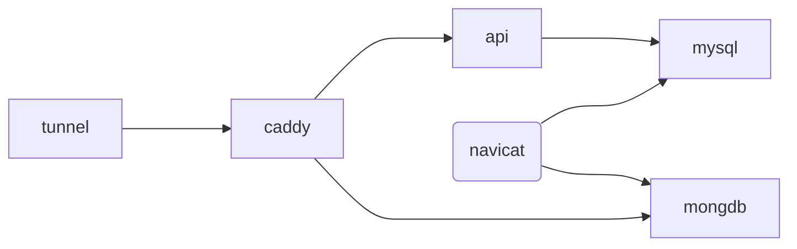

# autojs-backend-server

1. 设备卡密生成及绑定

2. 设备自动分组实现负载均衡

## 基本架构



- api 服务：承担需要持久化的数据内容以及一些逻辑判断的功能。采用 fastapi+mysql 构建
- mongdb 服务：承担任意的数据结构。可丢弃。采用 moser+ferretdb+postgres 构建
- caddy 服务：服务统一，请求认证。
- tunnel 服务：内网穿透
- 后台数据观察：用 navicat，连接 mongdb 和 mysql 即可。

# api 服务

1. 构建镜像启动容器

```shell
   docker-compose -f api-compose.yml -f mysql-compose.yml up
```

2. 查看 api 文档：

   http://127.0.0.1:80/docs

## 内网测试

```shell
docker-compose -f mongo-compose.yml -f mysql-compose.yml -f api-compose.yml -f caddy-compose.yml up
```

## 外网测试

```shell
docker-compose -f tunnel-compose.yml up
```
